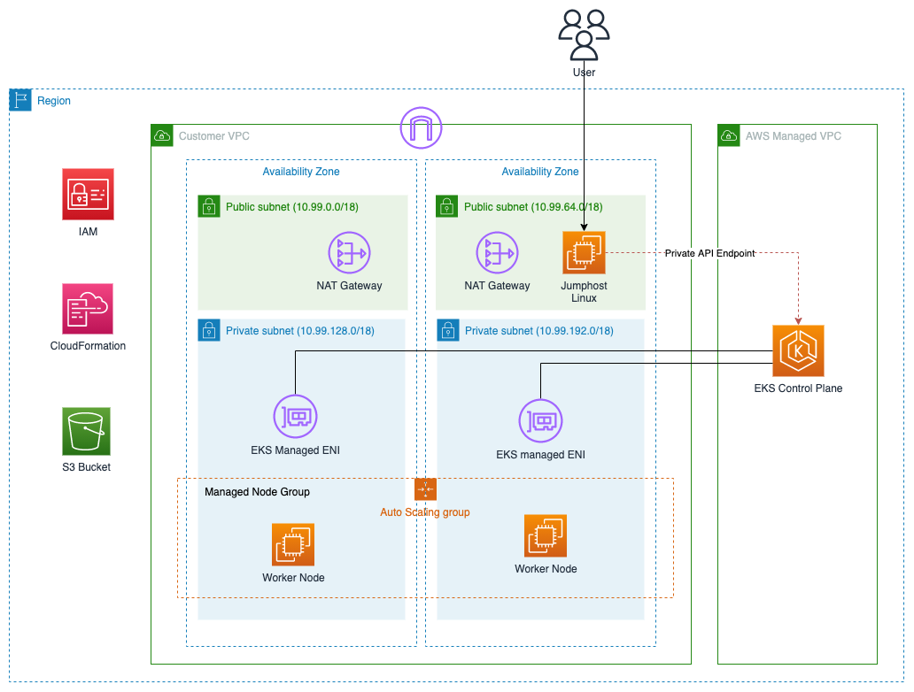
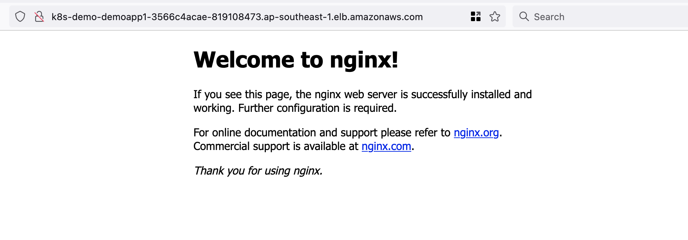

# CDK Template to Create Private EKS Cluster

This stack will create EKS Cluster with private endpoint. In addition to that, it will also creates the following resources:

1. Default VPC with CIDR 10.99.0.0/16
2. Public & private subnets across 2 Availability Zones, each using /18 segment.
3. Amazon Linux Jumphost server in the public subnet. It will use t3.micro instance.
4. Managed node group with initial 2 node using m5.xlarge.

This stack has been written in Typescript.

Below is the diagram depicting the entire  stack:



## Prerequisite

1. First you need to have AWS CLI in your environment. You can refer to [this link](https://docs.aws.amazon.com/cli/latest/userguide/getting-started-install.html) to install AWS Command Line Interface. 

    - You also need to prepare the IAM user with Access/Secret key. The user must have privileges to provision CloudFormation and other related resources. For development you can temporarily assign `AdministratorAccess`. 
    - Configure AWS CLI using `aws configure`. 

2. Second, you must install NodeJS for installing CDK.

    ```
    curl -o- https://raw.githubusercontent.com/nvm-sh/nvm/v0.34.0/install.sh | bash
    . ~/.nvm/nvm.sh
    nvm install node
    node -e "console.log('Running Node.js ' + process.version)"
    npx --version
    ```
3. Lastly we install AWS CDK version 2 using the following command:

    ```
    npm install -g aws-cdk
    cdk --version
    ```


## Deployment

1. Clone the project from GitHub:

    ```
    git clone https://github.com/ttirtawi/cdk-template-eks 
    cd cdk-template-eks 
    ```

2. Install all package dependencies:
    
    ```
    npm install
    ```

3. Prepare EC2 SSH key pair for the jumphost access (you must supply the value for `REGION_NAME` & `KEY_PAIR_NAME`):

    ```
    export REGION=<REGION_NAME>
    export KEYPAIR=<KEY_PAIR_NAME>
    aws --region=$REGION ec2 create-key-pair --key-name $KEYPAIR --query 'KeyMaterial' --output text > $KEYPAIR.pem
    ```

4. If this is the first time you deploy CDK stack, you must execute the following command to prepare CDK execution environment: 

    ```
    ACCOUNT_ID=$(aws sts get-caller-identity --query 'Account' --output text)
    cdk bootstrap aws://$ACCOUNT_ID/$REGION
    ```

5. We now can deploy the stack using the following command:

    ```
    export CLUSTER_NAME=<YOUR_CLUSTER_NAME>
    cdk deploy --context keyPair=$KEYPAIR --context clusterName=$CLUSTER_NAME
    ```

6. You will see the output below upon succesful deployment:

    

    From the output we will some of it in the test section:

    1. Public IP address of the jumphost
    2. EKS cluster config command that will help to update `~/.kube/config` file.


## Testing

1. Login to the Jumphost we just created.

    ```
    ssh -i <KEY_PAIR_NAME>.pem ec2-user@<PUBLIC_IP>
    ```
    
    The rest of the test steps below will be executed from within the Jumphost.

2. Run the command `aws eks update-kubeconfig` provided by stack output above. 

3. Check the EKS worker node using the following command:

    ```
    kubectl get node
    ```

    You should able to see 2 worker node.

4. Test create deployment & service:

    ```
    kubectl run --image nginx -p
    ```

5. To test Application Load Balancer Controller, we will create the Ingress using the following command:

    ```
    cat << EOF >> testpod.yml
    apiVersion: v1
    kind: Namespace
    metadata:
      name: demo
    ---
    apiVersion: apps/v1
    kind: Deployment
    metadata:
      name: app1-deployment
      namespace: demo
      labels:
        app: app1
    spec:
      replicas: 2
      selector:
        matchLabels:
          app: app1
      template:
        metadata:
          labels:
            app: app1
        spec:
          containers:
          - name: testapp1
            image: nginx 
            imagePullPolicy: Always
            ports: 
            - containerPort: 80
    ---
    apiVersion: v1
    kind: Service
    metadata:
      name: app1-service
      namespace: demo
      labels:
        app: app1
    spec:
      selector:
        app: app1
      type: NodePort
      ports:
        - name: http
          protocol: TCP
          port: 80
          targetPort: 80
    ---
    apiVersion: networking.k8s.io/v1
    kind: Ingress
    metadata:
      name: "demo-app1-ingress"
      namespace: demo
      annotations:
        kubernetes.io/ingress.class: alb
        alb.ingress.kubernetes.io/scheme: internet-facing
        alb.ingress.kubernetes.io/listen-ports: '[{"HTTP":80}]'
    spec:
      rules:
        - http:
            paths:
            - path: /app1
              pathType: Prefix
              backend:
                service:
                  name: app1-service
                  port:
                    number: 80
            - path: /
              pathType: Exact
              backend:
                service:
                  name: app1-service
                  port: 
                    number: 80

    EOF
    kubectl apply -f testpod.yml
    ```

    Verify the result:

    ```
    kubectl -n demo get pod,service,ingress
    ```

6. Validate the ingress controller load balancer URL from web browser. If everything works ok, you should see the output like this:

    


## Cleanup

To clean up / delete the entire stack run `cdk destroy` command.